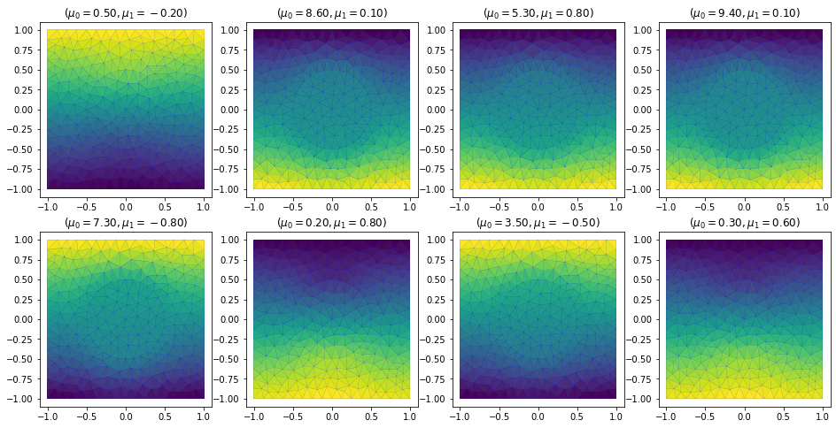
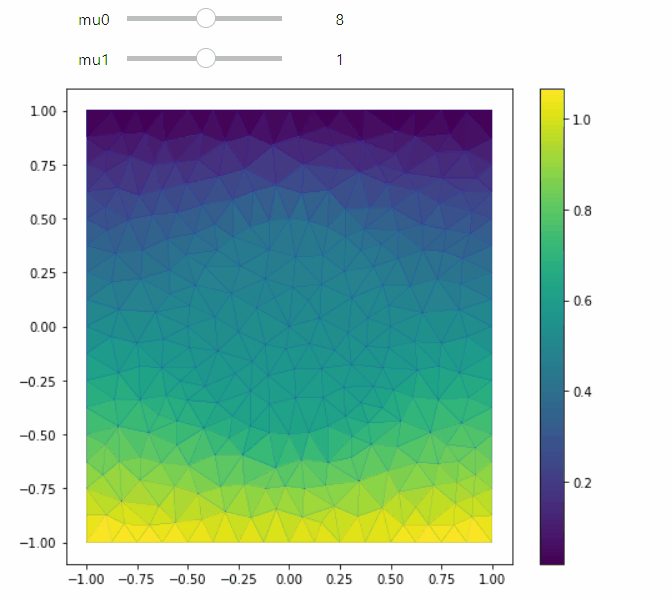

<p align="center">
  <a href="http://github.com/mathLab/PyDMD/" target="_blank" >
    
  </a>
</p>
<p align="center">
    <a href="https://doi.org/10.21105/joss.00661" target="_blank">
        
    </a>
    <a href="https://github.com/mathLab/EZyRB/blob/master/LICENSE.rst" target="_blank">
        
    </a>
    <a href="https://badge.fury.io/py/ezyrb">
        
    </a>
    <a href="https://travis-ci.org/mathLab/EZyRB" target="_blank">
        
    </a>
    <a href="https://coveralls.io/github/mathLab/EZyRB" target="_blank">
        
    </a>
    <a class="badge-align" href="https://www.codacy.com/app/mathLab/EZyRB?utm_source=github.com&amp;utm_medium=referral&amp;utm_content=mathLab/EZyRB&amp;utm_campaign=Badge_Grade">
        
    </a>
</p>


**EZyRB**: Easy Reduced Basis method

## Description
**EZyRB** is a python library for the Model Order Reduction based on **baricentric triangulation** for the selection of the parameter points and on **Proper Orthogonal Decomposition** for the selection of the modes. It is ideally suited for actual industrial problems, since its structure can interact with several simulation software simply providing the output file of the simulations. Up to now, it handles files in the vtk and mat formats. It has been used for the model order reduction of problems solved with matlab and openFOAM.

## Tutorial

See the [**Tutorial**](tutorials/tutorial-1.ipynb) to have an idea of the potential of this package:

### Offline training
The training phase has been performed offline on 8 snapshots computed with **FEniCS**:


The two parameters that were varying are:
* mu_0 controls the conductivity in the circular subdomain Omega_0;
* mu_1 controls the flux over Gamma_base.

### Online Evaluation
Once the Reduced Order Model is trained, it can be evaluated on new values of the parameters mu_0 & mu_1:



## Deployment on Heroku

Based on the following tutorial, this notebook can be deployed as a Voila app on heroku:
https://pythonforundergradengineers.com/deploy-jupyter-notebook-voila-heroku.html


## Dependencies and installation
**EZyRB** requires `numpy`, `scipy`, `matplotlib`, `vtk`, `nose` (for local
test) and `sphinx` (to generate the documentation).The coe has been tested with
Python3.5 version, but it should be compatible with Python3. It can be
installed using `pip` or directly from the source code.

### Installing from source
The official distribution is on GitHub, and you can clone the repository using
```bash
> git clone https://github.com/mathLab/EZyRB
```

To install the latest version of the package just type:
```bash
> pip install git+https://github.com/mathLab/EZyRB
```

Otherwise to install your own local branch you can use the `setup.py` file
```bash
> python setup.py install
```

To uninstall the package just use pip again:
```bash
> pip uninstall ezyrb
```

## License

See the [LICENSE](LICENSE.rst) file for license rights and limitations (MIT).
